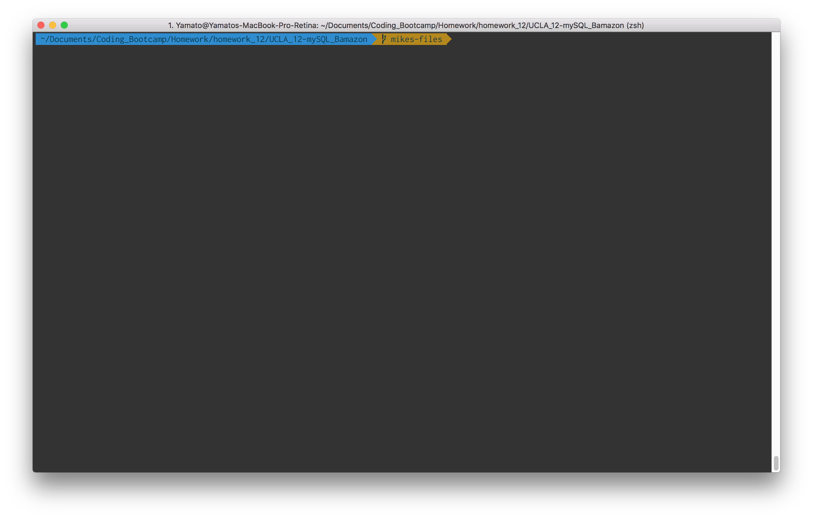

# UCLA_12-mySQL_Bamazon

## Live Link (If relevant)

## Description on how to use the app
- npm start

## Technologies Used
- npm mysql
- npm inquirer
- npm console.table

## Code Explaination
In this activity, I created an Amazon-like storefront with the MySQL skills I learned. The app will take in orders from customers and deplete stock from the store's inventory.